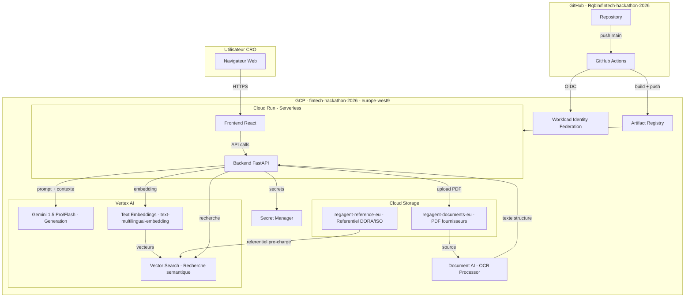
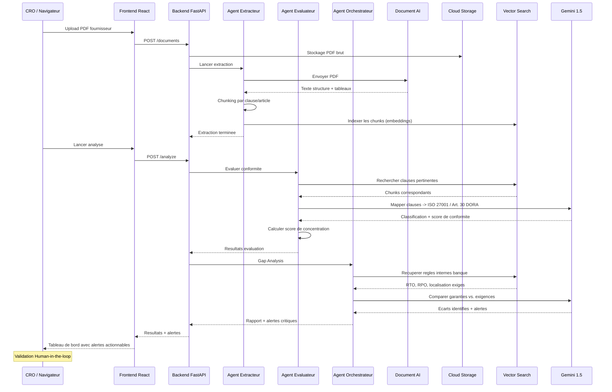

# RegAgent -- Infrastructure GCP et Structure du Projet

## Contexte du Projet

**RegAgent** est une plateforme "Compliance Tech" B2B multi-agents concue pour automatiser l'analyse des risques lies aux tiers (TPRM) dans le cadre de la conformite DORA. Le prototype est developpe lors du Paris Fintech Hackathon 2026 (24h, campus HEC).

### Parametres d'infrastructure

- **Projet GCP** : `fintech-hackathon-2026`
- **Facturation** : Compte d'essai `010D06-E96374-20CEED`
- **Base vectorielle** : Vertex AI Vector Search
- **LLM** : Gemini 1.5 Pro/Flash via Vertex AI
- **OCR** : Google Cloud Document AI
- **Region** : `europe-west9` (Paris) -- souverainete des donnees
- **Repo GitHub** : `Rqbln/fintech-hackathon-2026` (SSH, branche `main`, aucun commit)

### Architecture fonctionnelle (3 agents)

1. **Agent Extracteur** -- Ingere les PDF fournisseurs (contrats, SLA, SOC 2) via Document AI, extrait les garanties de securite
2. **Agent Evaluateur** -- Mappe les clauses extraites sur le referentiel ISO 27001/27005 + Article 30 DORA, calcule le score de risque de concentration
3. **Agent Orchestrateur** -- Realise le Gap Analysis (regles internes banque vs. garanties contractuelles), genere les alertes pour le CRO avec validation Human-in-the-loop

---

## Phase 1 : Provisionnement du projet GCP

### 1.1 Creer le projet et rattacher la facturation

```bash
gcloud projects create fintech-hackathon-2026 --name="Fintech Hackathon 2026"
gcloud billing projects link fintech-hackathon-2026 --billing-account=010D06-E96374-20CEED
gcloud config set project fintech-hackathon-2026
```

### 1.2 Activer les APIs necessaires

```bash
gcloud services enable \
  documentai.googleapis.com \
  aiplatform.googleapis.com \
  run.googleapis.com \
  artifactregistry.googleapis.com \
  cloudbuild.googleapis.com \
  storage.googleapis.com \
  iam.googleapis.com \
  iamcredentials.googleapis.com \
  cloudresourcemanager.googleapis.com \
  secretmanager.googleapis.com \
  cloudfunctions.googleapis.com \
  --project=fintech-hackathon-2026
```

| API | Service | Usage dans RegAgent |
|-----|---------|---------------------|
| `documentai.googleapis.com` | Document AI | Extraction OCR des PDF fournisseurs (SLA, SOC 2, contrats) |
| `aiplatform.googleapis.com` | Vertex AI | Gemini 1.5 Pro/Flash (generation) + Vector Search (RAG) + Embeddings |
| `run.googleapis.com` | Cloud Run | Backend FastAPI + Frontend React (serverless) |
| `artifactregistry.googleapis.com` | Artifact Registry | Images Docker backend et frontend |
| `cloudbuild.googleapis.com` | Cloud Build | Build des images Docker dans le CI/CD |
| `storage.googleapis.com` | Cloud Storage | PDF bruts + referentiel DORA/ISO |
| `iam.googleapis.com` | IAM | Gestion des roles et permissions |
| `iamcredentials.googleapis.com` | IAM Credentials | Workload Identity Federation (GitHub -> GCP) |
| `cloudresourcemanager.googleapis.com` | Resource Manager | Gestion du projet |
| `secretmanager.googleapis.com` | Secret Manager | Cles API, configuration sensible |
| `cloudfunctions.googleapis.com` | Cloud Functions | Pipeline de chunking/vectorisation event-driven |

### 1.3 Creer les buckets Cloud Storage

Deux buckets distincts pour separer documents bruts et referentiel normatif :

```bash
# Bucket pour les PDF fournisseurs (contrats, rapports SOC 2, SLA)
gcloud storage buckets create gs://regagent-documents-eu \
  --location=europe-west9 \
  --uniform-bucket-level-access \
  --project=fintech-hackathon-2026

# Bucket pour le referentiel DORA/ISO pre-charge
gcloud storage buckets create gs://regagent-reference-eu \
  --location=europe-west9 \
  --uniform-bucket-level-access \
  --project=fintech-hackathon-2026
```

Le bucket `regagent-reference-eu` contiendra :
- Les exigences de l'Article 30 DORA (clauses contractuelles cles)
- Le mapping ISO 27001:2022 -> DORA (controles A.5.19, A.5.21, A.5.23, A.5.30)
- La methodologie ISO 27005 (evaluation du risque)
- Le schema JSON des 15 modeles du Registre d'Information (RoI)

### 1.4 Creer le repository Artifact Registry

```bash
gcloud artifacts repositories create regagent-repo \
  --repository-format=docker \
  --location=europe-west9 \
  --project=fintech-hackathon-2026
```

### 1.5 Creer le processeur Document AI

```bash
# Creer un processeur OCR pour l'extraction de texte structure
gcloud document-ai processors create \
  --location=eu \
  --display-name="regagent-ocr" \
  --type="OCR_PROCESSOR" \
  --project=fintech-hackathon-2026
```

Ce processeur excelle pour :
- Extraction des tableaux de SLA (temps de restauration RTO/RPO)
- Identification des clauses juridiques dans les contrats
- Maintien du contexte spatial (signatures, annexes techniques)

---

## Phase 2 : Workload Identity Federation (GitHub -> GCP)

Zero clefs JSON stockees dans GitHub -- argument de securite fort pour le jury.

### 2.1 Creer le pool et le provider OIDC

```bash
gcloud iam workload-identity-pools create github-pool \
  --location=global \
  --display-name="GitHub Actions Pool" \
  --project=fintech-hackathon-2026

gcloud iam workload-identity-pools providers create-oidc github-provider \
  --location=global \
  --workload-identity-pool=github-pool \
  --issuer-uri="https://token.actions.githubusercontent.com" \
  --attribute-mapping="google.subject=assertion.sub,attribute.repository=assertion.repository" \
  --attribute-condition="assertion.repository=='Rqbln/fintech-hackathon-2026'" \
  --project=fintech-hackathon-2026
```

### 2.2 Creer le Service Account et les bindings IAM

```bash
# Service Account CI/CD
gcloud iam service-accounts create github-actions-sa \
  --display-name="GitHub Actions SA" \
  --project=fintech-hackathon-2026

# Recuperer le PROJECT_NUMBER dynamiquement
PROJECT_NUMBER=$(gcloud projects describe fintech-hackathon-2026 --format='value(projectNumber)')

# Roles necessaires pour le SA
for ROLE in roles/run.admin roles/artifactregistry.writer roles/iam.serviceAccountUser roles/storage.admin roles/aiplatform.user; do
  gcloud projects add-iam-policy-binding fintech-hackathon-2026 \
    --member="serviceAccount:github-actions-sa@fintech-hackathon-2026.iam.gserviceaccount.com" \
    --role="$ROLE"
done

# Liaison Workload Identity -> Service Account
gcloud iam service-accounts add-iam-policy-binding \
  github-actions-sa@fintech-hackathon-2026.iam.gserviceaccount.com \
  --role="roles/iam.workloadIdentityUser" \
  --member="principalSet://iam.googleapis.com/projects/${PROJECT_NUMBER}/locations/global/workloadIdentityPools/github-pool/attribute.repository/Rqbln/fintech-hackathon-2026" \
  --project=fintech-hackathon-2026
```

### 2.3 Service Account pour Cloud Run (runtime)

Le backend a besoin de permissions specifiques a l'execution :

```bash
gcloud iam service-accounts create regagent-runtime-sa \
  --display-name="RegAgent Runtime SA" \
  --project=fintech-hackathon-2026

for ROLE in roles/documentai.apiUser roles/aiplatform.user roles/storage.objectViewer roles/secretmanager.secretAccessor; do
  gcloud projects add-iam-policy-binding fintech-hackathon-2026 \
    --member="serviceAccount:regagent-runtime-sa@fintech-hackathon-2026.iam.gserviceaccount.com" \
    --role="$ROLE"
done
```

---

## Phase 3 : Structure du depot GitHub

Arborescence refletant l'architecture multi-agents et le flux de donnees en 3 etapes :

```
fintech-hackathon-2026/
  .github/
    workflows/
      deploy-backend.yml        # CI/CD backend FastAPI -> Cloud Run
      deploy-frontend.yml       # CI/CD frontend React -> Cloud Run
  backend/
    app/
      main.py                   # FastAPI entrypoint
      config.py                 # GCP project config, env vars
      routers/
        documents.py            # POST /documents (upload + ingestion)
        analysis.py             # POST /analyze (gap analysis)
        alerts.py               # GET /alerts (tableau de bord CRO)
        register.py             # GET /register (Registre d'Information RoI)
      agents/
        extractor.py            # Agent Extracteur (Document AI + parsing)
        evaluator.py            # Agent Evaluateur (mapping ISO/DORA + score)
        orchestrator.py         # Agent Orchestrateur (Gap Analysis + Gemini)
      services/
        document_ai.py          # Client Document AI
        vertex_ai.py            # Client Vertex AI (Gemini + Embeddings)
        vector_search.py        # Client Vertex AI Vector Search
        storage.py              # Client Cloud Storage
      models/
        schemas.py              # Pydantic models (Contract, Alert, RiskScore, RoI)
        dora_mapping.py         # Mapping Article 30 DORA -> controles ISO 27001
    Dockerfile
    requirements.txt
  frontend/
    src/
      components/
        Dashboard.tsx           # Tableau de bord CRO (alertes, scores)
        ContractUpload.tsx      # Upload de PDF fournisseurs
        GapAnalysis.tsx         # Visualisation des ecarts
        RiskMap.tsx             # Carte de concentration des risques
        RegisterView.tsx        # Vue du Registre d'Information (RoI)
      App.tsx
    Dockerfile
    package.json
  data_pipeline/
    ingestion/
      extract_text.py           # Pipeline Document AI -> texte structure
      chunker.py                # Decoupage en segments (par article/clause)
    vectorization/
      embed.py                  # Vertex AI Text Embeddings (text-multilingual-embedding)
      index_manager.py          # Creation/MAJ de l'index Vector Search
    reference/
      load_reference.py         # Chargement du referentiel DORA/ISO dans Vector Search
  reference_data/
    dora_article_30.json        # Exigences Article 30 (clauses contractuelles cles)
    iso27001_controls.json      # Controles ISO 27001:2022 pertinents
    iso27005_methodology.json   # Methodologie d'evaluation du risque
    roi_schema.json             # Schema des 15 modeles du Registre d'Information
    bank_rules_sample.json      # Regles internes banque (RTO, RPO, localisation)
  infra/
    (Terraform optionnel -- bonus jury)
  docs/
    (deja present -- analyses strategiques)
  .gitignore
  README.md
```

### 3.1 Fichier `.github/workflows/deploy-backend.yml`

Workflow declenchement : push sur `main` (path `backend/**`)

1. Authentification via Workload Identity Federation (OIDC)
2. Build image Docker `backend/Dockerfile`
3. Push vers `europe-west9-docker.pkg.dev/fintech-hackathon-2026/regagent-repo/backend`
4. Deploy sur Cloud Run avec service account `regagent-runtime-sa`
5. Variables : `GCP_PROJECT`, `GCP_REGION`, `DOCAI_PROCESSOR_ID`

### 3.2 Fichier `.github/workflows/deploy-frontend.yml`

Meme pattern que le backend, avec build React (npm build) puis conteneurisation nginx.

### 3.3 `.gitignore`

```
.env
.env.*
__pycache__/
*.pyc
.DS_Store
venv/
node_modules/
.terraform/
*.tfstate*
dist/
build/
```

### 3.4 Branches

- `main` : Production, deploiement automatique vers Cloud Run
- `dev` : Integration, merge des feature branches
- Convention : `feat/*`, `fix/*`, `data/*`

---

## Phase 4 : Verification et validation

### 4.1 Checklist de verification GCP

- [ ] Projet `fintech-hackathon-2026` cree et actif
- [ ] Facturation activee (compte `010D06-E96374-20CEED` lie)
- [ ] 11 APIs activees (lister avec `gcloud services list --enabled`)
- [ ] Buckets `regagent-documents-eu` et `regagent-reference-eu` accessibles
- [ ] Repository Artifact Registry `regagent-repo` cree
- [ ] Processeur Document AI `regagent-ocr` operationnel
- [ ] Workload Identity Federation fonctionnelle (test avec un workflow GHA minimal)

### 4.2 Test de connexion Gemini

```bash
curl -X POST \
  "https://europe-west9-aiplatform.googleapis.com/v1/projects/fintech-hackathon-2026/locations/europe-west9/publishers/google/models/gemini-1.5-flash:generateContent" \
  -H "Authorization: Bearer $(gcloud auth print-access-token)" \
  -H "Content-Type: application/json" \
  -d '{"contents":[{"parts":[{"text":"Reponds OK si tu fonctionnes."}]}]}'
```

### 4.3 Test de Document AI

Upload d'un PDF de test dans le bucket et traitement via le processeur OCR.

---

## Diagramme d'architecture



## Flux de donnees multi-agents


